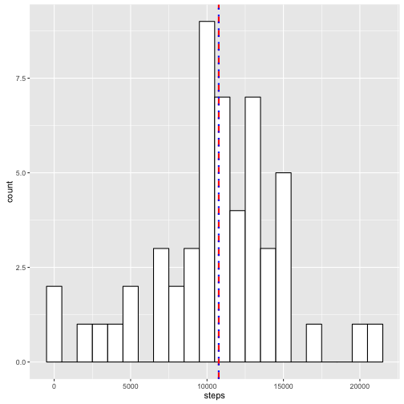
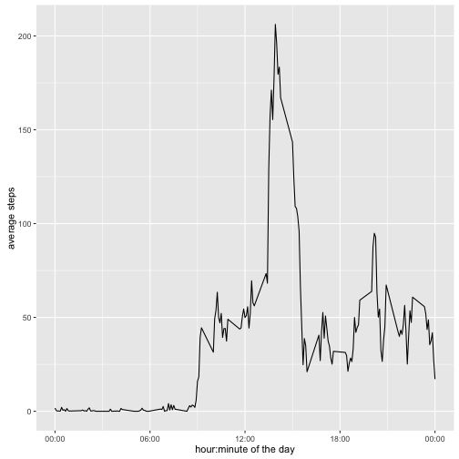
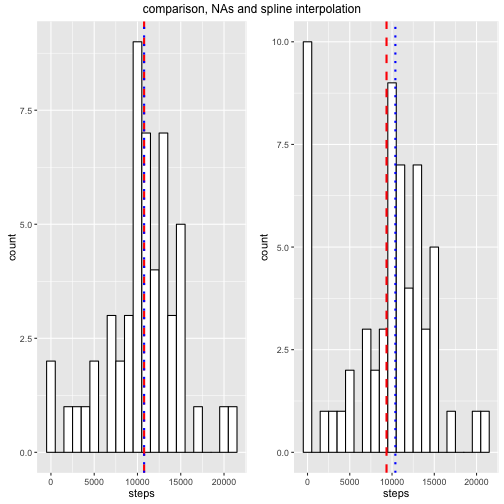
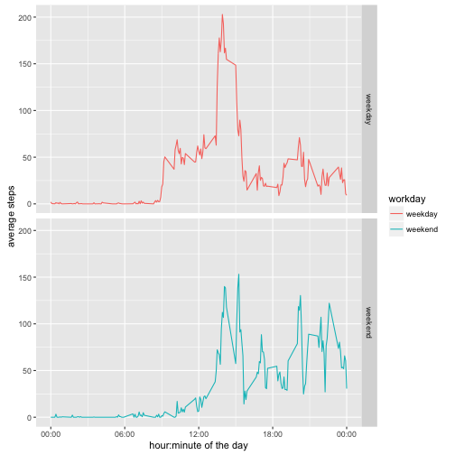

This study makes use of data from a personal activity monitoring device. This device collects data at 5 minute intervals through out the day. The data consists of two months of data from an anonymous individual collected during the months of October and November, 2012 and include the number of steps taken in 5 minute intervals each day.

We need a few libraries to start:


```r
library(dplyr)
library(ggplot2)
library(lubridate)
library(scales)
library(zoo)
library(gridExtra)
library(chron)
```

## Loading and preprocessing the data

##### 1. Load the data

The data is provided as part of this repository in a ziped file called `activity.zip`. We load the contents of this file in the `steps` dataset making sure we adjust `date` to the right type, Date.


```r
steps <- read.csv(unz('activity.zip', 'activity.csv'))  
head(steps, 2)
```

```
##   steps       date interval
## 1    NA 2012-10-01        0
## 2    NA 2012-10-01        5
```


##### 2. Process/transform the data (if necessary) into a format suitable for your analysis


```r
steps <- steps %>%
         mutate(date=date, interval=interval, hour=interval%/%60, minute=interval%%60, 
                ts=as.POSIXct(sprintf('%s %02d:%02d:00', date, hour, minute)))
head(steps, 2)
```

```
##   steps       date interval hour minute         ts
## 1    NA 2012-10-01        0    0      0 2012-10-01
## 2    NA 2012-10-01        5    0      5 2012-10-01
```

## What is mean total number of steps taken per day?

For this part of the assignment, you can ignore the missing values in the dataset.

##### 1. Calculate the total number of steps taken per day

The dataframe `daily` will bring the daily aggregate of steps in a day. Note that `daily` does not bring `NA` values, we use `na.omit()` in the second step of the `dplyr` pipeline.      


```r
daily <- steps %>%
         na.omit() %>% # remove NAs
         group_by(date) %>%
         summarize(steps=sum(steps))
head(daily, 2)
```

```
## Source: local data frame [2 x 2]
## 
##         date steps
## 1 2012-10-02   126
## 2 2012-10-03 11352
```

##### 2. Make a histogram of the total number of steps taken each day

We use `ggplot2` to make a histogram of the total number of steps taken each day. The mean and the median of the distribution is given by a red and blue vertical lines, respectively.


```r
ggplot(daily, aes(x=steps)) +
    geom_histogram(colour='black', fill='white', binwidth=1000) +
    geom_vline(aes(xintercept=mean(steps)), color='red', linetype='dashed', size=1) +
    geom_vline(aes(xintercept=median(steps)), color='blue', linetype='dotted', size=1)
```

 

##### 3. Calculate and report the mean and median of the total number of steps taken per day

The mean of steps is given by:

```{r}main
mean(daily$steps)
```

And the median by:


```r
median(daily$steps)
```

```
## [1] 10765
```

## What is the average daily activity pattern?

##### 1. Make a time series plot of the 5-minute interval and the average number of steps taken, averaged across all days

The time series of each of the 5-minute intervals of steps taken, across all days, is calculated by grouping by hour:minute of the day, and summarizing on the mean. The final `hm` value is re-converted back to `POSIXct` to allow for proper time series plotting.


```r
dailyMean <- steps %>%
             na.omit() %>% # remove NAs
             mutate(hm=sprintf("%02d:%02d", hour, minute)) %>%
             group_by(hm) %>%
             summarize(steps=mean(steps)) %>%
             mutate(hm=as.POSIXct(hm, format='%H:%M', tz='UTC'))
```

The time series plot of average steps, the x-axis brings the date and y-axis the average across all dates on the dataset.


```r
ggplot(dailyMean, aes(hm, steps)) +
    geom_line() +
    scale_x_datetime(labels=date_format('%H:%M')) +
    xlab('hour:minute of the day') +
    ylab('average steps')
```

 


##### 2. Which 5-minute interval, on average across all the days in the dataset, contains the maximum number of steps?

The maximum number of steps is given by filtering the row with steps the same as max of steps.


```r
maxDailyMean <- dailyMean %>% filter(steps == max(steps))
maxDailyMean
```

```
## Source: local data frame [1 x 2]
## 
##                    hm    steps
## 1 2016-03-20 13:55:00 206.1698
```


## Imputing missing values

That there are a number of days/intervals where there are missing values (coded as `NA`). The presence of missing days may introduce bias into some calculations or summaries of the data.

##### 1. Calculate and report the total number of missing values in the dataset (i.e. the total number of rows with `NAs`)

The total number of `NA` in the dataset:


```r
sum(is.na(steps))
```

```
## [1] 2304
```

And the total number of `NA` on column `steps`:


```r
sum(is.na(steps$steps))
```

```
## [1] 2304
```

And since they are the same, we know that all `NAs` are values in the column `steps`


```r
sum(is.na(steps)) == sum(is.na(steps$steps))
```

```
## [1] TRUE
```

##### 2. Devise a strategy for filling in all of the missing values in the dataset. The strategy does not need to be sophisticated. For example, you could use the mean/median for that day, or the mean for that 5-minute interval, etc.

We will be using the package `zoo` to fill `NA` values. We basically have three options: last observation carried forward (simply a copy of the last observation), approximation (linear interpolation) or spline (polynomial interpolation). We will be using `spline`.

##### 3. Create a new dataset that is equal to the original dataset but with the missing data filled in.


```r
stepsSpline <- steps
stepsSpline$steps <- na.spline(stepsSpline$steps, na.rm=FALSE)
```

Are there any `NA` values left?


```r
sum(is.na(stepsSpline$steps))
```

```
## [1] 0
```

No `NA` values left.

##### 4. Make a histogram of the total number of steps taken each day and Calculate and report the mean and median total number of steps taken per day. 

Prepare dataset:


```r
dailySpline <- stepsSpline %>%
         group_by(date) %>%
         summarize(steps=sum(steps))
head(daily, 2)
```

```
## Source: local data frame [2 x 2]
## 
##         date steps
## 1 2012-10-02   126
## 2 2012-10-03 11352
```

And plots:


```r
naPlot = ggplot(daily, aes(x=steps)) +
    geom_histogram(colour='black', fill='white', binwidth=1000) +
    geom_vline(aes(xintercept=mean(steps)), color='red', linetype='dashed', size=1) +
    geom_vline(aes(xintercept=median(steps)), color='blue', linetype='dotted', size=1)

splinePlot = ggplot(dailySpline, aes(x=steps)) +
    geom_histogram(colour='black', fill='white', binwidth=1000) +
    geom_vline(aes(xintercept=mean(steps)), color='red', linetype='dashed', size=1) +
    geom_vline(aes(xintercept=median(steps)), color='blue', linetype='dotted', size=1)

grid.arrange(naPlot, splinePlot, ncol=2, top='comparison, NAs and spline interpolation')
```

 

###### Do these values differ from the estimates from the first part of the assignment? What is the impact of imputing missing data on the estimates of the total daily number of steps?

Yes. The mean decreased by about 13%


```r
(mean(dailySpline$steps) - mean(daily$steps)) / mean(daily$steps)
```

```
## [1] -0.1316294
```

And the median by about 3.4%


```r
(median(dailySpline$steps) - median(daily$steps)) / median(daily$steps)
```

```
## [1] -0.03437065
```

## Are there differences in activity patterns between weekdays and weekends?

###### 1. Create a new factor variable in the dataset with two levels – “weekday” and “weekend” indicating whether a given date is a weekday or weekend day.


```r
weekends <- stepsSpline %>%
            mutate(weekend=is.weekend(date))
head(weekends, 2)
```

```
##           steps       date interval hour minute         ts weekend
## 1 9.852676e-145 2012-10-01        0    0      0 2012-10-01   FALSE
## 2 9.784492e-145 2012-10-01        5    0      5 2012-10-01   FALSE
```


```r
dailySplineMean <- weekends %>%
             na.omit() %>% # remove NAs
             mutate(hm=sprintf("%02d:%02d", hour, minute),
                    workday=ifelse(weekend, 'weekend', 'weekday')) %>%
             group_by(workday, hm) %>%
             summarize(steps=mean(steps)) %>%
             mutate(hm=as.POSIXct(hm, format='%H:%M', tz='UTC'))
```


###### 2. Make a panel plot containing a time series plot of the 5-minute interval and the average number of steps taken, averaged across all weekday days or weekend days 

The time series plot of the 5-minute interval is displayed on the x-axis, and the average number of steps taken, averaged across all weekday days or weekend days on the y-axis.


```r
ggplot(dailySplineMean, aes(hm, steps, col=workday)) +
    geom_line() +
    facet_grid(workday~.) +
    scale_x_datetime(labels=date_format('%H:%M')) +
    xlab('hour:minute of the day') +
    ylab('average steps')
```

 

We can see that the person is more active in late afternoon on weekends than weekdays. On the other hand, data shows more activity before and around noon during weekdays.
